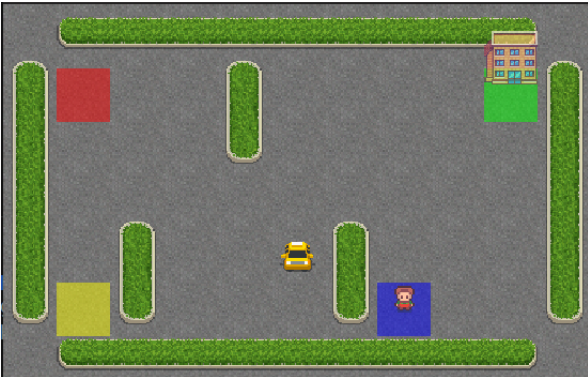

Given the following environment made of a grid (5x5) parking lot, a passenger and a self-driving taxi. The goal is that
the agent (the taxi) picks up the passenger and drop them into the desired location.
There exists four possible locations for the initial passenger location and the destination. These four locations are colored
in Red, Blue, Yellow and Green in the figure above.
The possible actions that the agent can do are:
The rewarding system is defined as follows:
At each episode, the agent starts at a random location, the passenger at one of the four possible locations (random) and
the destination is also at one of the four possible locations (random).

Given the following environment made of a grid (5x5) parking lot, a passenger and a self-driving taxi. The goal is that
the agent (the taxi) picks up the passenger and drop them into the desired location.

There exists four possible locations for the initial passenger location and the destination. These four locations are colored
in Red, Blue, Yellow and Green in the figure above.

The possible actions that the agent can do are:

- Go West
- Go East
- Go North
- Go South
- Pickup
- Drop-off

The rewarding system is defined as follows:

- If the agent correctly drops the passenger into the corresponding destination, they get a reward of +20
- If the agent drops off or picks up at the wrong location they get a reward of −10
- For each time-step, the agent gets a reward of −1

At each episode, the agent starts at a random location, the passenger at one of the four possible locations (random) and
the destination is also at one of the four possible locations (random).

